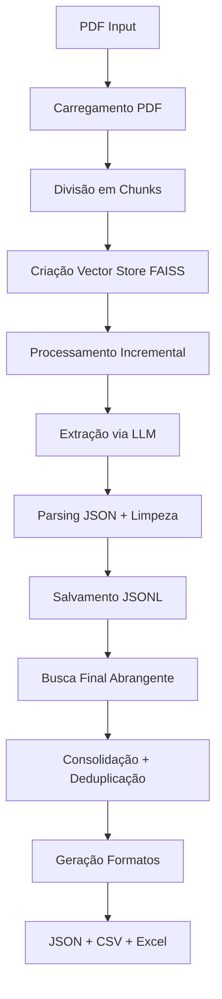

# PDF Vulnerability Extractor

## Resumo

Ferramenta profissional para extração automatizada de vulnerabilidades de relatórios PDF de segurança usando OpenAI GPT + LangChain + FAISS. Processa documentos grandes (305+ páginas) com busca vetorial inteligente, deduplicação automática e exportação em múltiplos formatos (JSON, CSV, Excel).

## Funcionalidades

✅ **Extração automatizada** de vulnerabilidades de relatórios PDF  
✅ **Processamento incremental** com recuperação de falhas  
✅ **Busca vetorial avançada** com FAISS para maior precisão  
✅ **Múltiplos formatos** de exportação (JSON, CSV, Excel)  
✅ **Deduplicação inteligente** de vulnerabilidades duplicadas  
✅ **Tratamento robusto** de erros e JSON malformado  
✅ **Interface Docker** simplificada para portabilidade  
✅ **Logs otimizados** com foco no progresso essencial  

## Dependências

### Software
- **Docker** e **Docker Compose** (recomendado)
- **Python 3.11+** (para execução local)
- **Git** para clonagem do repositório

### APIs
- **OpenAI API Key** com créditos disponíveis
- Modelos suportados: `gpt-3.5-turbo`, `gpt-4`

### Bibliotecas Python (instaladas automaticamente)
```
langchain>=0.1.0
langchain-openai>=0.0.5
faiss-cpu>=1.7.4
PyPDF2>=3.0.1
pandas>=2.0.0
openpyxl>=3.1.0
openai>=1.10.0
```

## Preocupações com Segurança

⚠️ **Proteção da API Key**
- Nunca commite `config.json` no controle de versão
- Use variáveis de ambiente em produção
- Rotacione chaves periodicamente

⚠️ **Dados Sensíveis**
- PDFs podem conter informações confidenciais
- Execute em ambiente isolado/containerizado
- Revise dados antes de compartilhar resultados

⚠️ **Rede e Conectividade**
- Ferramenta faz requisições para OpenAI API
- Configure proxy corporativo se necessário
- Monitore uso de API para evitar custos excessivos

## Instalação

### 1. Clone o Repositório
```bash
git clone https://github.com/AnonShield/pdf_reader_tenableWAS.git
cd pdf_reader_tenableWAS
```

### 2. Configure a API OpenAI
Edite o arquivo `config.json`:
```json
{
  "OPENAI_API_KEY": "sk-sua-chave-api-aqui",
  "MODEL_NAME": "gpt-3.5-turbo"
}
```

### 3. Execute com Docker (Recomendado)
```bash
docker compose up
```

### 4. Instalação Local (Alternativa)
```bash

python3 -m venv .venv
source .venv/bin/activate  # Linux/macOS
.venv\Scripts\activate  # Windows

pip install -r requirements.txt
python main.py
```

## Docker (Opcional)

### Build e Execução
```bash
# Build da imagem
docker compose build

# Execução padrão
docker compose up

# Execução em background
docker compose up -d

# Ver logs em tempo real
docker compose logs -f

# Parar containers
docker compose down
```

### Execução com Parâmetros
```bash
# Salvar em todos os formatos
docker compose run pdf-extractor --save-all

# PDF específico
docker compose run pdf-extractor --pdf "/app/host/meu_arquivo.pdf" --save-excel

# Diretório customizado
docker compose run pdf-extractor --output "/app/host/resultados" --save-csv
```

## Configuração

### Arquivo config.json
```json
{
  "OPENAI_API_KEY": "sk-proj-xxxxxxxxxxxxxxxxx",
  "MODEL_NAME": "gpt-3.5-turbo"
}
```

### Variáveis de Ambiente (Produção)
```bash
export OPENAI_API_KEY="sk-proj-xxxxxxxxxxxxxxxxx"
export MODEL_NAME="gpt-3.5-turbo"
```

### Estrutura de Volumes Docker
```yaml
volumes:
  - ./:/app/host              # Acesso aos arquivos do host
  - ./output:/app/output      # Diretório de saída
  - ./config.json:/app/config.json  # Configuração
```

## Uso

### Fluxo do Programa



### Execução Básica
```bash
# Processar PDF padrão
python main.py

# PDF específico
python main.py --pdf "scan_report.pdf"

# Com múltiplos formatos
python main.py --pdf "vulnerability_scan.pdf" --save-all
```

### Estrutura de Saída
```
output/
├── vulnerabilities_extracted.json    # Resultado principal
├── vulnerabilities_extracted.csv     # Formato planilha
├── vulnerabilities_extracted.xlsx    # Excel com estatísticas
└── vulnerabilities_incremental.jsonl # Log incremental
```

## Experimentos

### Argumentos de Linha de Comando
```
usage: main.py [-h] [--pdf PDF] [--output OUTPUT] [--save-csv] [--save-excel] [--save-all]

options:
  --pdf PDF        Caminho para o arquivo PDF (padrão: arquivo de exemplo)
  --output OUTPUT  Diretório de saída (padrão: ./output)
  --save-csv       Salvar em formato CSV
  --save-excel     Salvar em formato Excel
  --save-all       Salvar em todos os formatos
```

### Exemplos de Uso

#### Experimento 1: Processamento Básico
```bash
python main.py --pdf "nessus_scan.pdf"
```
**Resultado**: JSON com vulnerabilidades estruturadas

#### Experimento 2: Análise Comparativa
```bash
python main.py --pdf "scan_antes.pdf" --output "./antes" --save-all
python main.py --pdf "scan_depois.pdf" --output "./depois" --save-all
```
**Resultado**: Relatórios comparativos em múltiplos formatos

#### Experimento 3: Processamento em Lote
```bash
for pdf in scans/*.pdf; do
  python main.py --pdf "$pdf" --output "./results/$(basename $pdf .pdf)" --save-excel
done
```
**Resultado**: Excel individual para cada scan

### Casos de Teste
- **PDF pequeno**: < 50 páginas (~2-5 minutos)
- **PDF médio**: 100-200 páginas (~10-15 minutos)  
- **PDF grande**: 300+ páginas (~20-30 minutos)

## Estrutura do Código

```
pdf_reader_tenableWAS/
├── main.py                     # Ponto de entrada principal
├── config.json                 # Configurações da aplicação
├── requirements.txt            # Dependências Python
├── Dockerfile                  # Configuração do container
├── docker-compose.yml          # Orquestração Docker
├── src/                        # Módulos da aplicação
│   ├── __init__.py
│   ├── config.py              # Gerenciamento de configuração
│   ├── pdf_processor.py       # Processamento PDF e vetorização
│   ├── vulnerability_extractor.py  # Extração e parsing
│   ├── data_converter.py      # Conversão de formatos
│   └── utils.py               # Utilitários e processamento
└── output/                    # Resultados gerados
```

### Módulos Principais

#### `main.py`
- Orquestração geral do fluxo
- Interface de linha de comando
- Tratamento de argumentos

#### `src/pdf_processor.py`
- Carregamento de PDFs com PyPDF2
- Divisão em chunks inteligente
- Criação de vector store FAISS

#### `src/vulnerability_extractor.py`
- Extração via modelos OpenAI
- Parsing robusto de JSON
- Processamento incremental

#### `src/data_converter.py`
- Conversão JSON → CSV
- Geração Excel com múltiplas abas
- Preservação de todos os campos

#### `src/utils.py`
- Consolidação de resultados
- Deduplicação de vulnerabilidades
- Validação de arquivos

## Extensibilidade

### Adicionando Novos Formatos de Saída

1. **Implementar conversor** em `src/data_converter.py`:
```python
def json_to_xml(self, json_file_path: str) -> str:
    """Converter JSON para XML."""
    # Implementação aqui
    pass
```

2. **Adicionar parâmetro CLI** em `main.py`:
```python
parser.add_argument("--save-xml", action="store_true", 
                   help="Salvar em formato XML")
```

3. **Integrar no fluxo** principal:
```python
if save_xml:
    xml_path = self.data_converter.json_to_xml(final_path)
```

### Adicionando Novos Modelos LLM

1. **Configurar novo modelo** em `config.json`:
