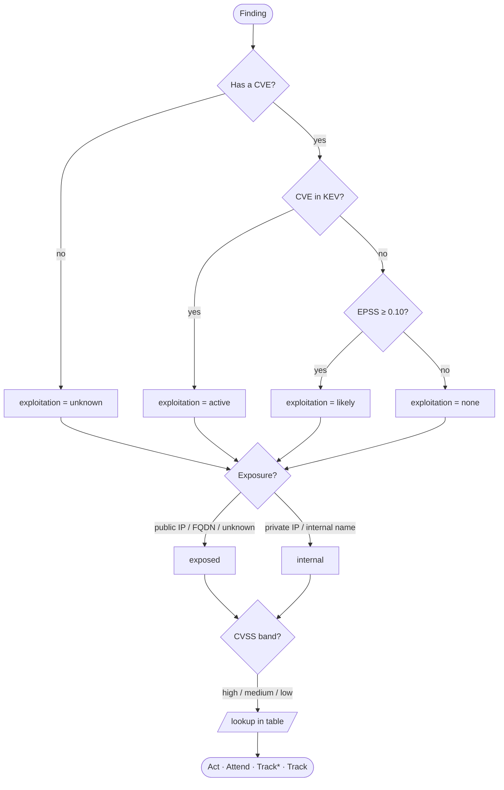

# Prioritization

MulitaMiner extracts and structures scanner findings; the **prioritization layer**
turns that list into a **remediation queue** — *what to fix first*. A scan report
easily holds hundreds of findings and nobody fixes them all at once, so the queue
answers the only question that matters operationally: where to start.

The ranking is **deterministic and auditable** — a decision tree over public threat
signals. Every input that drove a decision is written as a column, so any
category can be re-derived by hand.

It runs automatically at the end of an extraction and writes
`<report>_prioritization.csv` and `.xlsx` next to the JSON.

---

## The signals

Each finding is reduced to a few signals, each derived deterministically from data
already in the report plus two small public feeds.

### CVSS — how severe is the flaw (0–10)

The scanner's own base score. Measures the *technical* severity of the flaw in the
abstract (network-reachable? needs credentials? how big is the impact?). It does **not**
say whether anyone is actually exploiting it — which is why severity alone is a poor
queue: almost everything ends up "high". We bucket it:

| CVSS | band |
|---|---|
| ≥ 7.0 | high |
| 4.0 – 6.9 | medium |
| < 4.0 (or absent) | low / fall back to the scanner's `severity` label |

### EPSS — how likely is exploitation soon (0–100%)

The **Exploit Prediction Scoring System** (FIRST.org): a daily-updated probability that
a CVE will be exploited in the next 30 days. Where CVSS says "this *could* be bad", EPSS
says "this is *likely to be attacked*". It only exists per CVE.

### KEV — is it being exploited right now (yes/no)

CISA's **Known Exploited Vulnerabilities** catalog: CVEs with *confirmed, active*
exploitation in the wild. A binary, and the strongest signal there is — it is observed
fact, not prediction. Only exists per CVE.

### Exposure — is the asset reachable (exposed / internal)

Derived from the finding's host. The same flaw is far more urgent on an
internet-facing asset than on an isolated internal one.

Scanners name the host field differently, so it is resolved from a small
**configurable list** (`HOST_FIELDS` in `signals.py`): direct fields are tried in
order (`host`, `hostname`, `ip`, `ip_address`, `target`, `url`, …), then the host
nested inside a list of `instances` (Tenable WAS stores it there as a URL, e.g.
`instances[].instance = https://app/api`). To support a new scanner, add its field
name to the list — no code change. The resolved value is then classified:

- **Private/loopback IP** (RFC 1918 `10/8`, `172.16/12`, `192.168/16`, `127/8`, IPv6
  `::1`) → `internal`.
- **Internal-looking name** — a single-label host (`srv01`, no dot, never a public FQDN)
  or a private/special-use suffix (`.local`, `.internal`, `.lan`, `.home`, `.corp`,
  `.intranet`) → `internal`.
- **Everything else** — public IP, public FQDN, a WAS URL, or a missing host → `exposed`.

Exposure is **cautious by default**: anything we cannot confidently call internal is
treated as exposed. The name heuristic only ever moves a finding *to* internal, so it can
correct a false "exposed" but can never wrongly downgrade a public asset. It runs offline
(no DNS lookup), preserving the on-premise / air-gapped guarantee — at the cost of not
catching an internal host that happens to sit on a public domain (that stays "exposed").

### Exploitation — the rolled-up exploitation evidence

KEV + EPSS + the presence of a CVE collapse into one signal:

| value | meaning |
|---|---|
| `active` | a CVE is in **KEV** — confirmed exploitation |
| `likely` | **EPSS ≥ threshold** (see below) |
| `none` | has a CVE, but KEV/EPSS show little evidence — *we checked* |
| `unknown` | **no CVE at all**, so KEV/EPSS cannot be consulted |

`none` vs `unknown` is an important distinction. A finding with no CVE (typical of web
app scans — SQL injection, XSS, missing headers) cannot be looked up in KEV/EPSS. Absence
of a CVE key is **absence of evidence, not evidence of safety**, so it is *not* discounted
as "none". It is treated one notch more cautiously (see the tree).

#### The EPSS threshold follows FIRST

The `likely` cutoff defaults to **EPSS ≥ 0.10**. This is not an arbitrary pick: it is the
operating point referenced by FIRST for the EPSS model — near the F1-optimal remediation
cutoff in FIRST's own threshold analysis. Using the published reference rather than tuning
to our own reports keeps the choice defensible for users whose reports we have never seen.
It is **configurable** (the `threshold` argument) for teams with a different risk
tolerance. See the [References](#references).

---

## The decision tree (SSVC)

The three signals — `exploitation` × `exposure` × `severity` — feed an **SSVC**-style
decision tree (Stakeholder-Specific Vulnerability Categorization, CISA). SSVC is used
instead of a weighted formula on purpose: a formula like `0.5·CVSS + 0.3·EPSS + …` needs
arbitrary weights (indefensible) and double-counts exploitability (CVSS already encodes
some). A decision tree asks concrete questions and is fully explainable.



The full mapping (exploitation × exposure × severity → category):

| Exploitation | Exposure | high | medium | low |
|---|---|---|---|---|
| **active** (KEV) | exposed | Act | Act | Attend |
| **active** (KEV) | internal | Act | Attend | Track\* |
| **likely** (EPSS) | exposed | Act | Attend | Track\* |
| **likely** (EPSS) | internal | Attend | Track\* | Track |
| **unknown** (no CVE) | exposed | Act | Attend | Track\* |
| **unknown** (no CVE) | internal | Attend | Track\* | Track |
| **none** | exposed | Attend | Track\* | Track |
| **none** | internal | Track\* | Track | Track |

Notes:
- **`unknown` sits one notch above `none`** (same row as `likely`): a severe, exposed
  finding with no CVE — e.g. a CVSS 9 SQL injection from a web app scan — reaches **Act**,
  rather than being buried because it lacks a CVE to prove exploitation.
- **Different scanners enter through different rows.** Network scans (OpenVAS) are
  CVE-rich, so they exercise the `active`/`likely`/`none` rows. Web app scans (Tenable
  WAS) are mostly CVE-less, so they ride the `unknown` rows, decided by exposure ×
  severity.

### What the categories mean

The four outcomes come from SSVC:

| Category | Meaning | Action |
|---|---|---|
| **Act** | Active/likely exploitation or a severe exposed flaw | Remediate now — top of the queue |
| **Attend** | Real concern, not a fire drill | Schedule remediation soon, supervised |
| **Track\*** | Worth watching; conditions could raise it | Re-evaluate at the next cycle; monitor closely |
| **Track** | Low urgency | Handle in normal maintenance |

### From categories to a queue

SSVC yields four buckets, not a total order. Within each bucket the queue is sorted by
**EPSS descending**, then **CVSS descending** as a tie-break (covers no-CVE findings,
which have no EPSS). The result is a fully ordered list: Act first (highest EPSS on top),
then Attend, Track\*, Track.

---

## Unit of the queue

**One row per finding.** A finding is the unit of remediation — it already binds a single
host, and the fix ("upgrade Tomcat") is one action even when the finding bundles several
CVEs. Multiple CVEs in a finding are aggregated: exploitation uses the worst case across
them, and all CVE IDs are listed in the `cves` column. Splitting one finding into a row
per CVE would only duplicate rows without changing the action.

---

## Output

Written next to the extraction JSON as `<report>_prioritization.csv` and `.xlsx`
(CSV for tooling/diff, XLSX because specialists review in Excel). Columns:

| Column | Meaning |
|---|---|
| `rank` | position in the queue (1 = most urgent) |
| `name` | finding name |
| `host` | asset the finding was found on |
| `category` | Act / Attend / Track\* / Track |
| `exposure` | exposed / internal |
| `exploitation` | active / likely / none / unknown |
| `severity` | high / medium / low |
| `kev` | true if any CVE is in KEV |
| `epss` | highest EPSS among the finding's CVEs |
| `cvss` | the finding's CVSS base score |
| `cves` | CVE IDs found in the finding |
| `justification` | one-line, human-readable reason for the category |
| `snapshot_date` | EPSS score date of the feeds used — makes the ranking reproducible |

Because every signal is a column and `snapshot_date` pins the feed version, anyone can
re-run the table by hand and reach the same category. That is the "explainable &
reproducible" property made concrete.

---

## Feeds and sync

The layer needs only two small public feeds (~5 MB total) — it does **not** need a full
NVD mirror.

| Feed | Source | Size | Update |
|---|---|---|---|
| KEV | CISA | ~1–2 MB JSON | daily (whole file) |
| EPSS | FIRST | ~2–3 MB gzip CSV | daily (one file) |

Feeds live in `resources/feeds/` (gitignored, regenerable cache). They refresh
**automatically**: before each extraction's prioritization step, a missing or >1-day-old
snapshot is re-synced (one ~5 MB download per day at most; several extractions the same day
reuse the fresh copy). So you never have to remember `python tools/sync_feeds.py` — though
that command still works for a manual/scheduled refresh. If a CVE you scan is not in the
local copy it simply contributes no EPSS/KEV signal; if the feeds are missing and can't be
fetched, prioritization prints a notice and is **skipped** — it never costs the extraction.

**Auto-sync is network-tolerant and opt-out.** A failed download (offline) falls back to
the existing local snapshot. To disable auto-sync entirely — e.g. an air-gapped host that
syncs out-of-band — set `MULITA_FEED_AUTOSYNC=0`; prioritization then only reads whatever
local snapshot is present.

**Privacy / air-gapped.** The feeds are public, so syncing them leaks nothing about your
findings. For an air-gapped host: set `MULITA_FEED_AUTOSYNC=0`, run the sync on a connected
machine, and copy the ~5 MB `resources/feeds/` over. Nothing about the scan ever leaves the
machine at prioritization time. In Docker, mount `resources/feeds/` as a volume (like
`outputs/`) — never bake feeds into the image (they go stale daily; `resources/feeds/` is in
`.dockerignore`).

---

## Calibration and limitations

- **EPSS threshold (0.10)** — the FIRST-referenced default; configurable per risk
  tolerance. Lower → more findings become `likely` (bigger urgent pile); higher → leans on
  KEV + CVSS only.
- **`unknown` rows** — placing no-CVE findings one notch above `none` is a deliberate
  cautious policy. The exact severity-band → category mapping is the natural thing to
  validate with a domain expert, since no-CVE findings have no "future KEV" to backtest
  against.
- **Exposure of named hosts** — an internal host on a *public* domain still reads as
  `exposed` (the heuristic is offline and errs toward caution). Resolving names to IPs
  would be more accurate but breaks the air-gapped guarantee, so it is intentionally not
  done.
## Validation

Two senses: *is it correct?* and *is it good?*

**Correct** (the code does what the design says) is covered by the unit tests — the tree
is checked exhaustively over all 24 input combinations, plus signal extraction, the queue,
and feeds/auto-sync.

**Good** (the ranking surfaces the right things) has no single ground truth, so it is
validated empirically with **backtesting against future KEV** via `tools/backtest.py`:

```bash
python tools/backtest.py --input <extraction.json|baseline.xlsx> --date <scan-date>
```

It ranks the report using only what was known at the scan date (the EPSS snapshot of that
day, KEV filtered to `dateAdded <= T`), then checks which findings' CVEs entered KEV
*after* T — the ones that demonstrably became actively exploited — and reports where the
queue ranked them (category split, precision@k, positive ranks). The current KEV supplies
the "future", so sync it first.

Honest scope: only **CVE-bearing** findings can be scored (no-CVE findings have no KEV
future — validate those with a domain expert instead), and **deliberately-vulnerable test
apps yield few or zero positives** (their CVEs are mostly already in KEV or never enter it),
so the result is illustrative — a powered study needs many real-world dated reports. The
tool reports the positive count up front, so a no-signal report is an explicit, honest
outcome rather than a silent pass.

The tree itself is also checked against the **canonical CISA SSVC Deployer tree** via
`tools/ssvc_check.py` (our tree is a simplification — no `Automatable` axis, CVSS as a Human
Impact proxy — so each cell is compared to the canonical outcome for both automatable
settings). The check confirms our tree **skews intentionally toward urgency**: the
divergences are almost all "more urgent than canonical", driven by deliberate choices —
treating EPSS-`likely` above SSVC's "public PoC", the no-CVE `unknown`→Act policy, and a
security-tool bias on confirmed exploitation. It is a documented-assumptions comparison, so
a divergence means "departs from canonical under our mapping", not "wrong".

---

## References

- FIRST — **EPSS** (Exploit Prediction Scoring System), model and threshold guidance:
  <https://www.first.org/epss/>
- CISA — **Known Exploited Vulnerabilities (KEV)** catalog:
  <https://www.cisa.gov/known-exploited-vulnerabilities-catalog>
- CISA — **SSVC** (Stakeholder-Specific Vulnerability Categorization):
  <https://www.cisa.gov/stakeholder-specific-vulnerability-categorization-ssvc>
- FIRST — **CVSS** (Common Vulnerability Scoring System):
  <https://www.first.org/cvss/>
